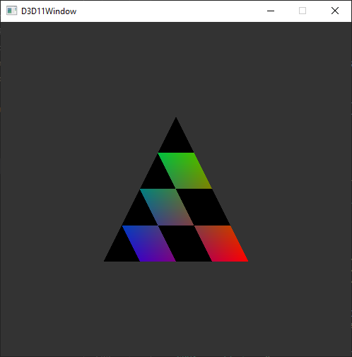

Zig D3D11 Triangle
=========================

This project is simply a classic "Hello, Triangle" program, written in Zig, using
[Win32 bindings](https://github.com/marlersoft/zigwin32) by Johnatan Marler, which allow for quite a seamless integration with Win32. Fun!

The code is **highly** inspired by the [minimal d3d11](https://gist.github.com/d7samurai/261c69490cce0620d0bfc93003cd1052) by [d7samurai](https://github.com/d7samurai), but we just draw a simple triangle ;)

## To build
Ensure that you have aforementioned Win32 bindings in the same folder to which you clone this repo.
Then run `zig build` and it should just work!

